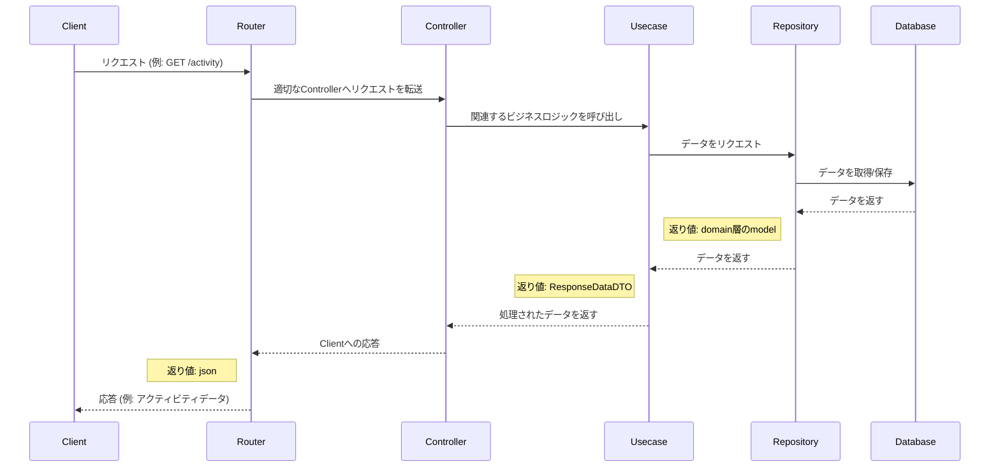

## バックエンド

### 使用言語
  - Go言語
### ライブラリ
  - Gorm
    - ORM
  - Goose
    - マイグレーション
  - go-chi
    - https
  - Air
    - ホットリロード
  - swaggo
    - ドキュメント自動生成
### ディレクトリ構成
```
.
├── README.md
├── api
│   ├── config
│   │   └── config.go
│   ├── controller
│   │   ├── activityController.go ルーティングでここのコントローラを呼ぶ
│   │   └── historyController.go
│   ├── di
│   │   ├── wire.go
│   │   └── wire_gen.go
│   ├── domain
│   │   ├── model // ビジネスモデル
│   │   │   └── model.go 
│   │   └── repository // DB操作の処理をinterfaceで定義
│   │       ├── activityRepository.go 
│   │       └── historyRepository.go
│   ├── go.mod
│   ├── go.sum
│   ├── infrastructure 
│   │   ├── connection.go
│   │   ├── orm
│   │   │   └── gorm_model.go // DBアクセス時に使用
│   │   └── repository // domain層のrepositoryを実装する
│   │       ├── activityRepositoryImpl.go
│   │       └── historyRepositoryImpl.go
│   ├── main.go
│   ├── router
│   │   └── router.go  //ここでルーティング
│   ├── tmp
│   │   └── main
│   └── usecase //今回のアプリケーションのビジネスロジックはここに書く
│       ├── activityUsecase.go
│       ├── dto // model層のデータをdtoを通して書き換える
│       │   ├── activityResponseDto.go
│       │   └── historyResponseDto.go
│       └── historyUsecase.go
└── dockerfile

```



## 
```bash
go mod init yoshimi-I/AttendanceApp
```

## Dockerで迷子になったら
- まずはディレクトリ構成を把握
```
docker build --target build -t temp-image .
```
- そのあとlsやpwdを押してルートを確認
```
docker run --rm temp-image ls
```
