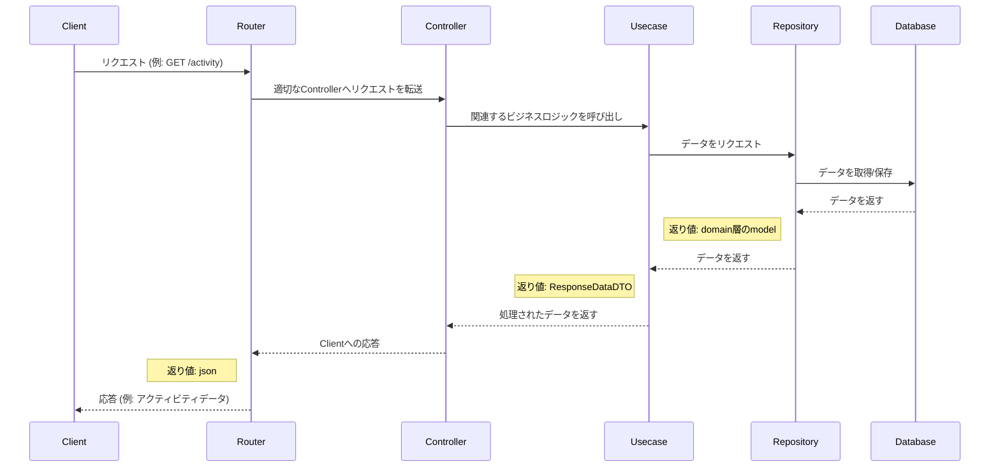

## バックエンド

### 使用言語
  - Go言語
### ライブラリ
  - Gorm
    - ORM
  - Goose
    - マイグレーション
  - go-chi
    - https
  - Air
    - ホットリロード
  - swaggo
    - ドキュメント自動生成
### ディレクトリ構成
```
.
├── README.md
├── api
│   ├── domain
│   │   ├── model
│   │   │   ├── attendance.go
│   │   │   ├── attendanceType.go
│   │   │   ├── user.go
│   │   │   ├── userStatus.go
│   │   │   └── userStatusType.go
│   │   └── repository
│   │       ├── activityRepository.go
│   │       ├── historyRepository.go
│   │       └── userRepository.go
│   ├── go.mod
│   ├── go.sum
│   ├── infrastructure
│   │   ├── connectionDB.go
│   │   ├── di
│   │   │   ├── wire.go
│   │   │   └── wire_gen.go
│   │   ├── orm
│   │   │   └── gorm_model.go
│   │   └── repository
│   │       ├── activityRepositoryImpl.go
│   │       ├── historyRepositoryImpl.go
│   │       └── userRepositoryImpl.go
│   ├── main.go
│   ├── presentation
│   │   ├── controller
│   │   │   ├── activityController.go
│   │   │   ├── historyController.go
│   │   │   └── userController.go
│   │   ├── parameter
│   │   └── router
│   │       ├── middleware
│   │       │   └── cors.go
│   │       └── router.go
│   ├── tmp
│   │   └── main
│   ├── usecase
│   │   ├── activityUsecase.go
│   │   ├── dto
│   │   │   ├── request
│   │   │   │   ├── activityDTO.go
│   │   │   │   └── user.go
│   │   │   └── response
│   │   │       ├── activityDto.go
│   │   │       ├── historyDto.go
│   │   │       └── user.go
│   │   ├── historyUsecase.go
│   │   └── userUsecase.go
│   └── utility
│       ├── errorUtility.go
│       └── timeUtility.go
└── dockerfile

```



## 
```bash
go mod init yoshimi-I/AttendanceApp
```

## Dockerで迷子になったら
- まずはディレクトリ構成を把握
```
docker build --target build -t temp-image .
```
- そのあとlsやpwdを押してルートを確認
```
docker run --rm temp-image ls
```
