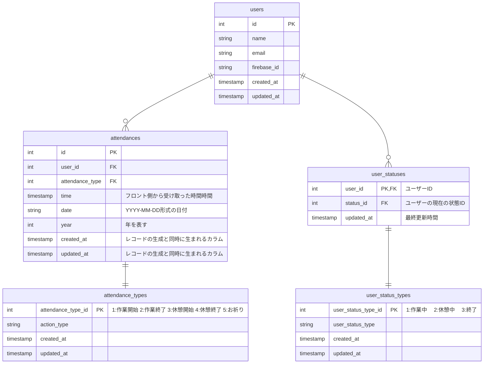

```mermaid
erDiagram
    users ||--o{ attendances : ""
    attendances ||--|| attendance_types : ""
    users ||--o{ user_statuses : ""
    user_statuses ||--|| user_status_types : ""


    users {
        int id PK
        string name
        string email
        string firebase_id
        timestamp created_at
        timestamp updated_at
    }

    attendances {
        int id PK
        int user_id FK
        int attendance_type FK
        timestamp time "フロント側から受け取った時間時間"
        string date "YYYY-MM-DD形式の日付"
        int year "年を表す"
        timestamp created_at "レコードの生成と同時に生まれるカラム"
        timestamp updated_at "レコードの生成と同時に生まれるカラム"
    }

    attendance_types {
        int attendance_type_id PK "1:作業開始 2:作業終了 3:休憩開始 4:休憩終了 5:お祈り"
        string action_type
        timestamp created_at
        timestamp updated_at
    }

    user_status_types {
        int user_status_type_id PK "1:作業中 　2:休憩中 　3:終了"
        string user_status_type
        timestamp created_at
        timestamp updated_at
    }

    user_statuses {
        int user_id PK,FK "ユーザーID"
        int status_id FK "ユーザーの現在の状態ID"
        timestamp updated_at "最終更新時間"
    }

```
