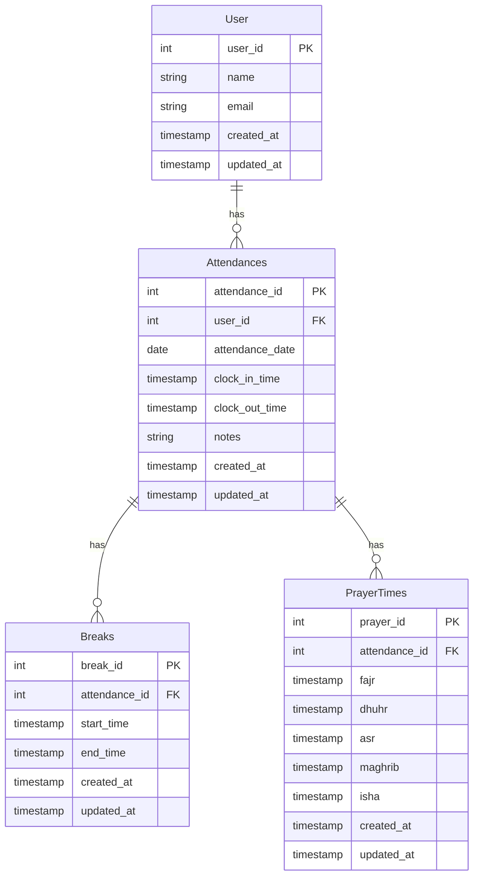

```mermaid
erDiagram
    User ||--o{ Attendances : "has"
    Attendances ||--o{ Breaks : "has"
    Attendances ||--o{ PrayerTimes : "has"

    User {
        int user_id PK
        string name
        string email
        timestamp created_at
        timestamp updated_at
    }

    Attendances {
        int attendance_id PK
        int user_id FK
        date attendance_date
        timestamp clock_in_time
        timestamp clock_out_time
        string notes
        timestamp created_at
        timestamp updated_at
    }

    Breaks {
        int break_id PK
        int attendance_id FK
        timestamp start_time
        timestamp end_time
        timestamp created_at
        timestamp updated_at
    }

    PrayerTimes {
        int prayer_id PK
        int attendance_id FK
        timestamp fajr
        timestamp dhuhr
        timestamp asr
        timestamp maghrib
        timestamp isha
        timestamp created_at
        timestamp updated_at
    }

```
