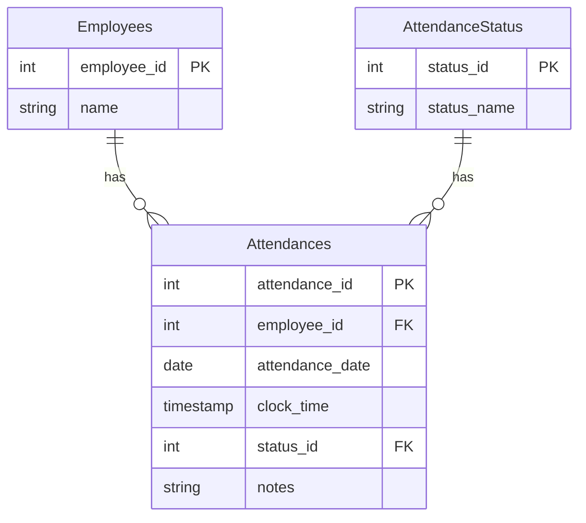

```mermaid
erDiagram
    Employees ||--o{ Attendances : "has"
    AttendanceStatus ||--o{ Attendances : "has"
    
    Employees {
        int employee_id PK
        string name
    }
    
    AttendanceStatus {
        int status_id PK
        string status_name
    }
    
    Attendances {
        int attendance_id PK
        int employee_id FK
        date attendance_date
        timestamp clock_time
        int status_id FK
        string notes
    }
```
