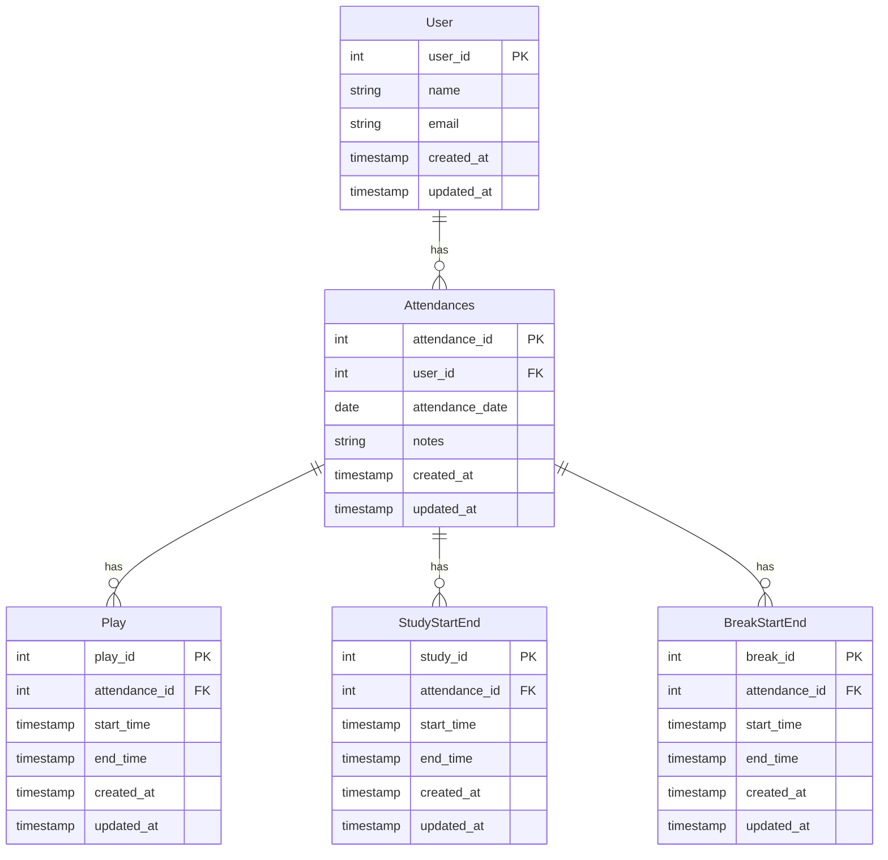

```mermaid
erDiagram
    User ||--o{ Attendances : "has"
    Attendances ||--o{ Play : "has"
    Attendances ||--o{ StudyStartEnd : "has"
    Attendances ||--o{ BreakStartEnd : "has"

    User {
        int user_id PK
        string name
        string email
        timestamp created_at
        timestamp updated_at
    }

    Attendances {
        int attendance_id PK
        int user_id FK
        date attendance_date
        string notes
        timestamp created_at
        timestamp updated_at
    }

    Play {
        int play_id PK
        int attendance_id FK
        timestamp start_time
        timestamp end_time
        timestamp created_at
        timestamp updated_at
    }

    StudyStartEnd {
        int study_id PK
        int attendance_id FK
        timestamp start_time
        timestamp end_time
        timestamp created_at
        timestamp updated_at
    }

    BreakStartEnd {
        int break_id PK
        int attendance_id FK
        timestamp start_time
        timestamp end_time
        timestamp created_at
        timestamp updated_at
    }

```
