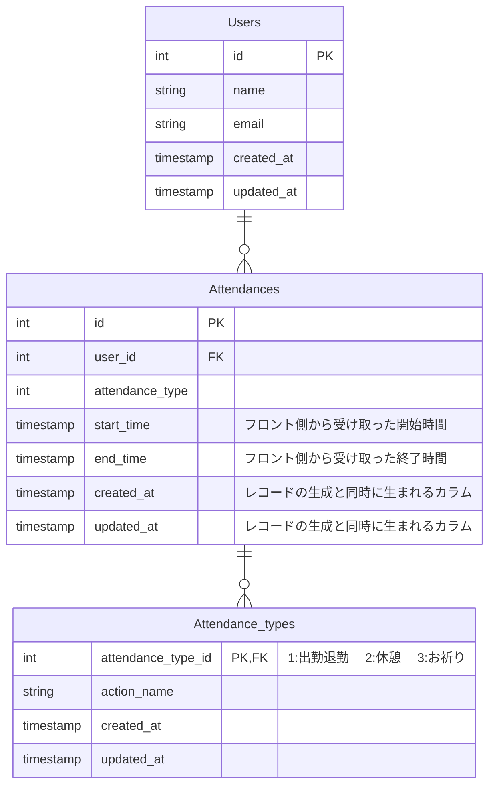

```mermaid
erDiagram
    Users ||--o{ Attendances : ""
    Attendances ||--o{ Attendance_types : ""

    Users {
        int id PK
        string name
        string email
        timestamp created_at
        timestamp updated_at
    }

    Attendances {
        int id PK
        int user_id FK
        int attendance_type
        timestamp start_time "フロント側から受け取った開始時間"
        timestamp end_time "フロント側から受け取った終了時間"
        timestamp created_at　"レコードの生成と同時に生まれるカラム"
        timestamp updated_at　"レコードの生成と同時に生まれるカラム"
    }
    Attendance_types {
        int attendance_type_id PK,FK"1:出勤退勤 　2:休憩 　3:お祈り" 
        string action_name
        timestamp created_at
        timestamp updated_at
    }


```
